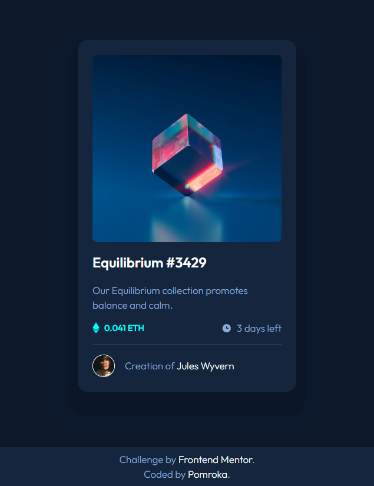

# Frontend Mentor - QR code component solution

This is a solution to the [NFT preview card component challenge on Frontend Mentor](https://www.frontendmentor.io/challenges/nft-preview-card-component-SbdUL_w0U). Frontend Mentor challenges help you improve your coding skills by building realistic projects. 

## Table of contents

- [Overview](#overview)
  - [Screenshot](#screenshot)
  - [Links](#links)
- [My process](#my-process)
  - [Built with](#built-with)
  - [Useful resources](#useful-resources)
- [Author](#author)

## Overview

### Screenshot

  

### Links

- Solution URL: [https://github.com/Pomroka/nft-preview-card](https://github.com/Pomroka/nft-preview-card)
- Live Site URL: [https://Pomroka.github.io/nft-preview-card](https://Pomroka.github.io/nft-preview-card)

## My process

### Built with

- CSS custom properties
- Flexbox
- Mobile-first workflow

### Useful resources

- [CSS Reset](https://piccalil.li/blog/a-modern-css-reset/) - A reset of sensible defaults
- [Kevin Powell YouTube channel](https://www.youtube.com/@KevinPowell) - This is an amazing channel.

## Author

- Frontend Mentor - [@Pomroka](https://www.frontendmentor.io/profile/Pomroka)
